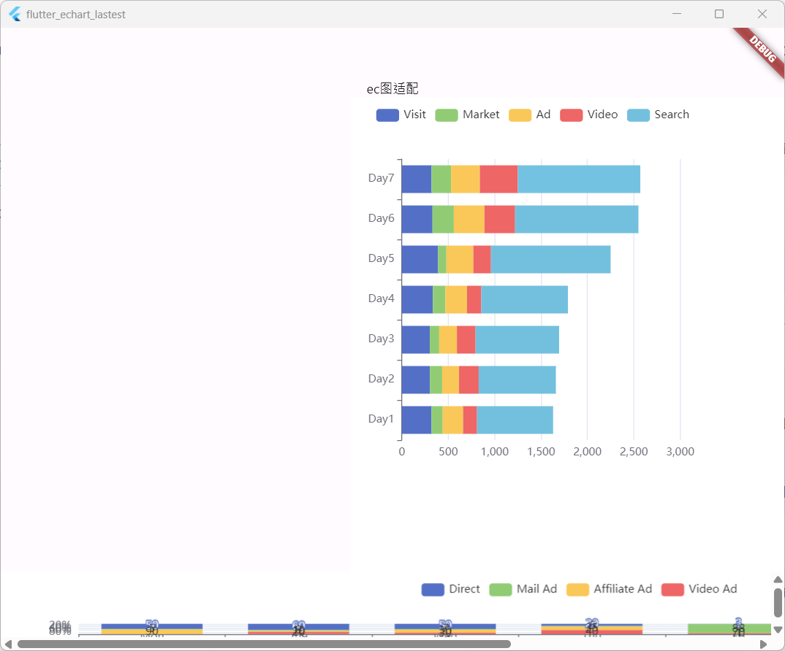
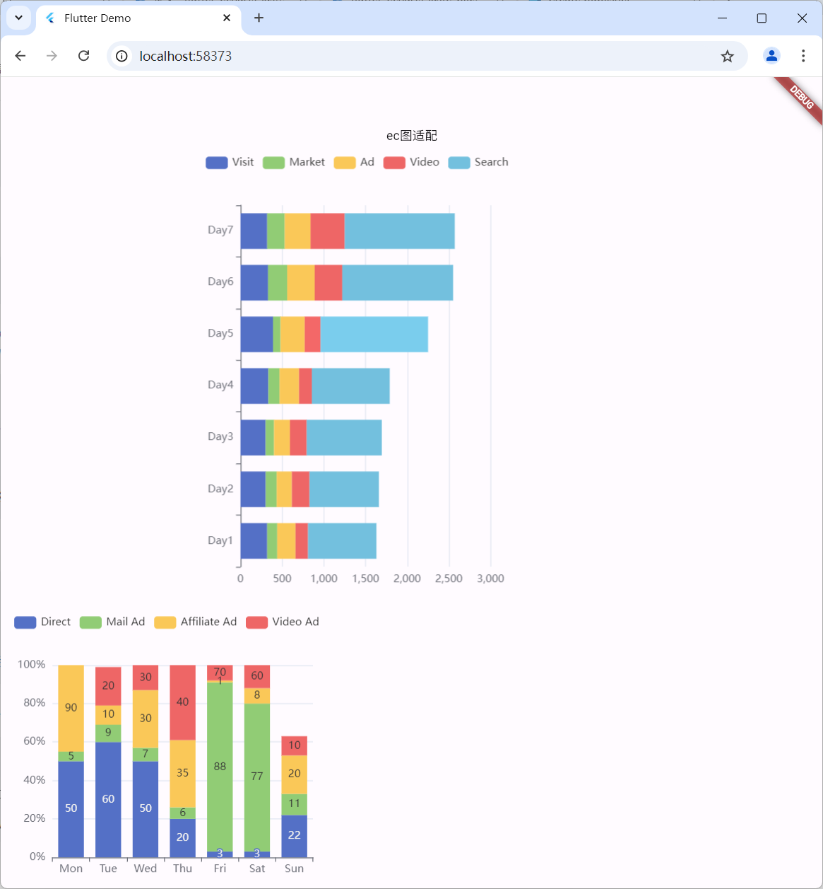

<!--
This README describes the package. If you publish this package to pub.dev,
this README's contents appear on the landing page for your package.

For information about how to write a good package README, see the guide for
[writing package pages](https://dart.dev/guides/libraries/writing-package-pages).

For general information about developing packages, see the Dart guide for
[creating packages](https://dart.dev/guides/libraries/create-library-packages)
and the Flutter guide for
[developing packages and plugins](https://flutter.dev/developing-packages).
-->

TODO: Put a short description of the package here that helps potential users
know whether this package might be useful for them.

TODO: Include short and useful examples for package users. Add longer examples
to `/example` folder.

```dart
             Container(
                    width: 500,
                    height: 520,
                child: Center(child: EchartsInit(option: '''{
                      legend: {
                        data: ['Visit', 'Market', 'Ad', 'Video', 'Search']
                      },
                      grid: {
                        left: '3%',
                        right: '8%',
                        bottom: '3%',
                        containLabel: true
                      },
                      xAxis: {
                        type: 'value'
                      },
                      yAxis: {
                        type: 'category',
                        data: ['Day1', 'Day2', 'Day3', 'Day4', 'Day5', 'Day6', 'Day7']
                      },
                      series: [
                        {
                          name: 'Visit',
                          type: 'bar',
                          stack: 'total',
                          data: [320, 302, 301, 334, 390, 330, 320]
                        },
                        {
                          name: 'Market',
                          type: 'bar',
                          stack: 'total',
                          data: [120, 132, 101, 134, 90, 230, 210]
                        },
                        {
                          name: 'Ad',
                          type: 'bar',
                          stack: 'total',
                          data: [220, 182, 191, 234, 290, 330, 310]
                        },
                        {
                          name: 'Video',
                          type: 'bar',
                          stack: 'total',
                          data: [150, 212, 201, 154, 190, 330, 410]
                        },
                        {
                          name: 'Search',
                          type: 'bar',
                          stack: 'total',
                          data: [820, 832, 901, 934, 1290, 1330, 1320]
                        }
                      ]
                    }'''))),
```
## Windows


## Web


